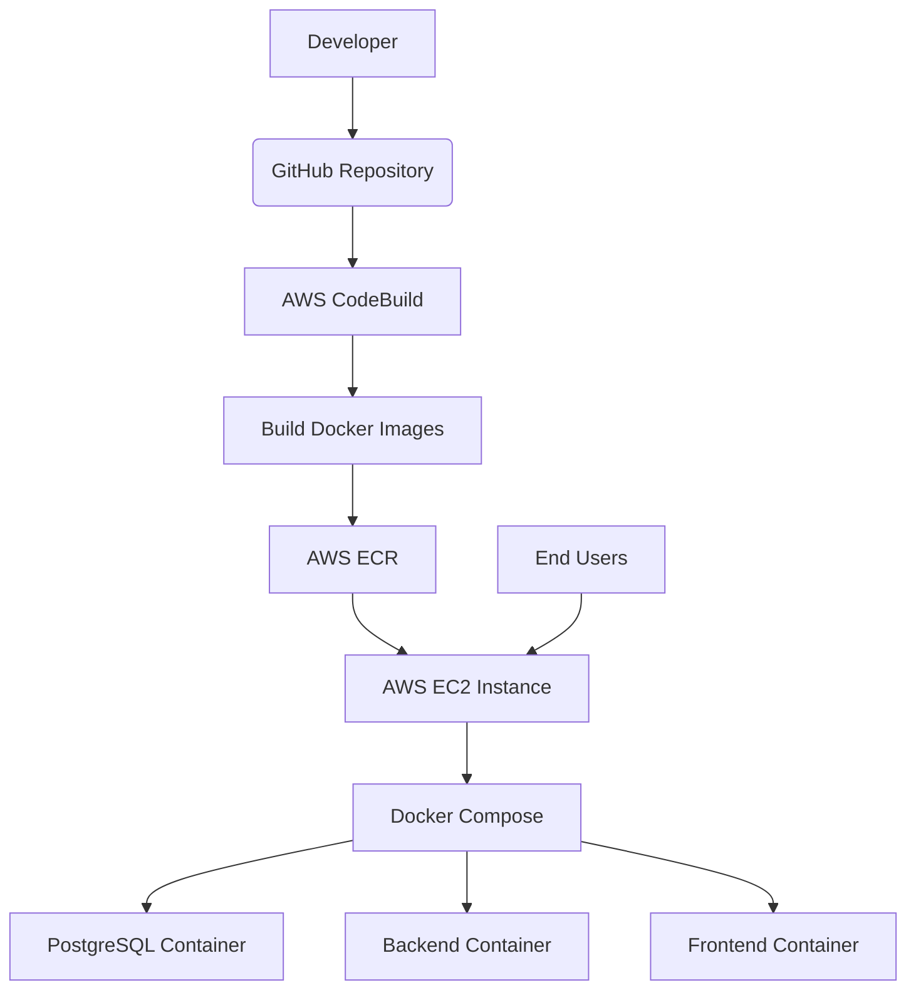

# AutoBlog AWS Deployment Architecture

## Overview
This document describes the deployment architecture for the AutoBlog system on AWS, following the specified requirements.

## Architecture Diagram



## Component Details

### 1. GitHub Repository
- Source code repository containing:
  - Backend application
  - Frontend application
  - Dockerfiles for both applications
  - Infrastructure as Code (docker-compose.yml, buildspec.yml)
  - Deployment scripts

### 2. AWS CodeBuild
- Pulls code from GitHub repository
- Uses `infra/buildspec.yml` for build instructions
- Builds separate Docker images for:
  - Frontend application
  - Backend application
- Pushes images to AWS ECR

### 3. AWS ECR (Elastic Container Registry)
- Stores Docker images:
  - `autoblog-frontend:latest`
  - `autoblog-backend:latest`

### 4. AWS EC2 Instance
- Single instance hosting all services
- Runs Docker Compose to orchestrate containers
- Contains three containers:
  - PostgreSQL database
  - Backend API service
  - Frontend web application

## Deployment Flow

### Phase 1: Build Process
1. Developer pushes code to GitHub
2. AWS CodeBuild automatically triggers (or manually initiated)
3. CodeBuild pulls the repository
4. CodeBuild builds Docker images using respective Dockerfiles:
   - `frontend/Dockerfile` for frontend
   - `backend/Dockerfile` for backend
5. CodeBuild pushes images to ECR repositories

### Phase 2: Deployment Process
1. EC2 instance pulls latest images from ECR
2. Docker Compose starts containers:
   - PostgreSQL database container
   - Backend API container
   - Frontend web application container
3. Services are accessible via EC2 public IP:
   - Port 80: Frontend web application
   - Port 5000: Backend API

## Security Groups Configuration

The EC2 instance requires the following security group rules:

| Type | Protocol | Port | Source |
|------|----------|------|--------|
| SSH | TCP | 22 | Your IP |
| HTTP | TCP | 80 | 0.0.0.0/0 |
| Custom TCP | TCP | 5000 | 0.0.0.0/0 |

## Environment Variables

The EC2 instance requires the following environment variables in `/opt/autoblog/.env`:

```
# PostgreSQL Configuration
POSTGRES_USER=autoblog
POSTGRES_PASSWORD=secure_password_here
POSTGRES_DB=autoblog

# Session Secret
SESSION_SECRET=another_secure_secret_here

# Optional: HuggingFace API Key
HUGGINGFACE_API_KEY=your_huggingface_api_key

# AWS Configuration
AWS_DEFAULT_REGION=us-east-1
AWS_ACCOUNT_ID=your_aws_account_id
```

## Deployment Commands

### On EC2 Instance
```bash
# Pull and run latest images
cd /opt/autoblog
./infra/scripts/ec2-deploy.sh

# View logs
docker-compose logs -f

# Check status
docker-compose ps

# Restart services
docker-compose restart
```

## Access Points

After deployment, the application will be accessible at:

- **Frontend**: `http://EC2_PUBLIC_IP`
- **Backend API**: `http://EC2_PUBLIC_IP:5000/api`
- **Health Check**: `http://EC2_PUBLIC_IP:5000/api/health`

## Maintenance

### Updating the Application
1. Push new code to GitHub
2. Run CodeBuild to build and push new images
3. On EC2 instance, run: `./infra/scripts/ec2-deploy.sh`

### Backup and Recovery
- Database is persisted in a Docker volume
- Use provided backup scripts for additional data protection

## Scaling Considerations

While this deployment uses a single EC2 instance as required, for production environments consider:
- Using RDS instead of containerized PostgreSQL
- Adding a load balancer for high availability
- Using ECS for better container orchestration
- Implementing auto-scaling groups